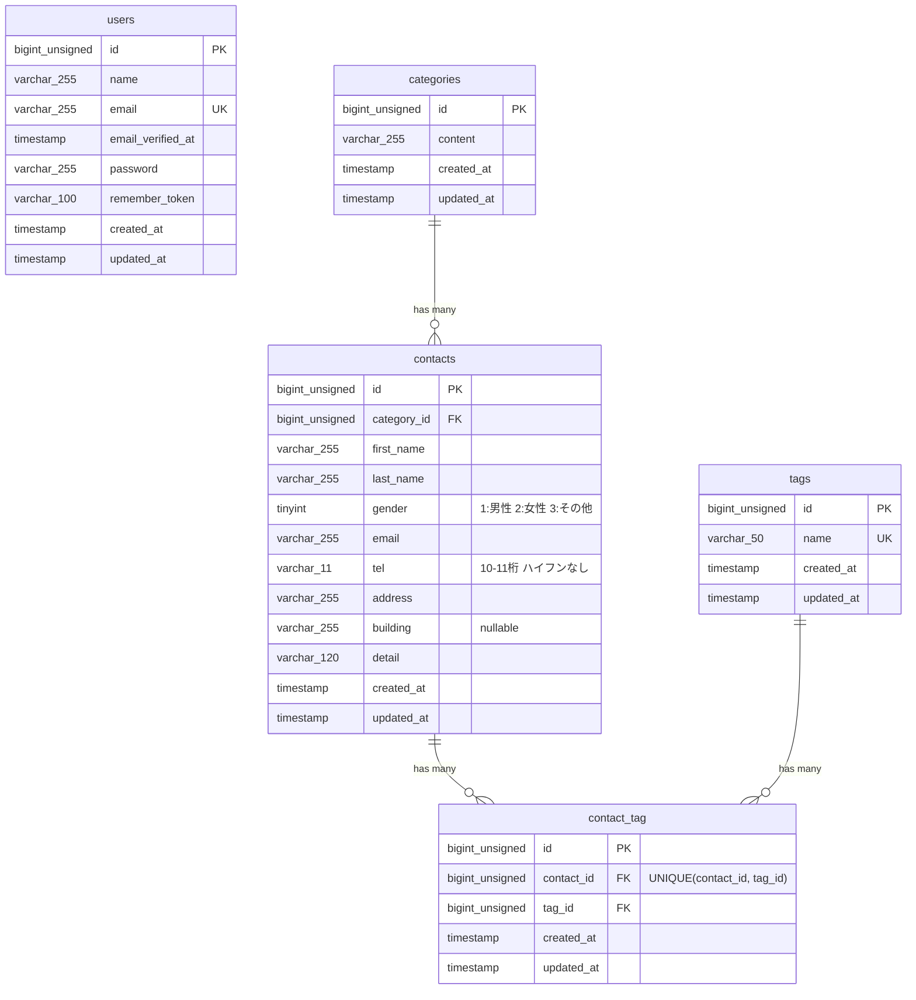

# 要件シート（SSR版）

本ドキュメントは、SSR（サーバーサイドレンダリング）版 確認テスト「お問い合わせフォーム」の要件シートです。
旧版（API + Web ハイブリッド構成）から、Laravel従来型（Blade + Webルート）構成に全面移行した内容を反映しています。

---

## 1. ターム内容

| 項目 | 内容 |
|------|------|
| タイトル | 基礎学習ターム 確認テスト_お問い合わせフォーム |
| 目的 | 確認テストを通して、教材で学んだバックエンド技術（Laravel, DB設計, テスト）を実践的にアウトプットし、復習箇所を洗い出すこと |
| 期間 | コーチと相談の上決めてください。 |
| やること | バックエンド開発（DB設計、Webルート実装、テスト作成）<br>※Bladeテンプレートは完成品として提供されるため、フロントエンド実装は不要です |
| 作成物 | coachtech お問い合わせフォーム<br><br>【システム概要】<br>本システムは、一般ユーザーが利用する公開のお問い合わせフォームです。<br>誰でもお問い合わせを送信でき、管理者はログイン後にその内容を確認・管理します。 |
| ルール | 原則質問チャットサポートの利用は禁止です。<br><br>留意点：<br>1. 教材やブラウザで検索した記事を参考にすることは可能です。<br>2. GitHubでのエラーが解決できず、確認テストの提出が困難な場合はコーチに相談してください。<br>3. 質問の利用数はCOACHTECH Proの合格基準とさせていただきますので、できるだけ質問対応は利用しないようにしましょう！ |
| 提出方法 | LMSのテスト一覧画面から提出してください。 |
| 注意点 | 教材学習の集大成で、少し難易度が高いです。<br>焦らず、一歩一歩開発を進めていきましょう。<br>また基本機能の開発が終了次第、応用機能の開発に着手してください。<br><br>【S評価について】<br>S評価は正答率80%以上で付与されます。<br>基礎機能のみではS評価には到達できません。<br>S評価を目指す場合は、応用機能にも取り組む必要があります。 |

---

## 2. 開発プロセス

こちらは環境構築、コード品質、テスト要件の詳細資料です。
採点において重要な要件やアプリケーション全体を跨ぐ要件が記載していますので、十分に確認してください。
また赤字は応用要件になります。基本要件実装後に着手してください。

| 項目 | カテゴリ | 詳細仕様 | 留意点 |
|------|---------|---------|--------|
| 仕様理解 | アーキテクチャ | 【重要】本プロジェクトのアーキテクチャについて（Traditional Web構成）<br>本課題では、バックエンド開発の基礎力を身につけるため、以下のアクセス方式で実装します。<br><br>Webブラウザ向け機能（Traditional Web / SSR）:<br>Bladeテンプレートを使用し、セッション認証（Cookie）で動作する従来のWebアプリケーション機能。<br>routes/web.php と通常のコントローラーを使用します。<br><br>※応用機能として、お問い合わせデータのCRUD操作が可能な公開API（routes/api.php）も実装します。認証は不要で、Sanctumは使用しません。 | |
| 環境 | 技術スタック | OS（Dockerが動作する任意のOS）: -<br>PHP : 8.2<br>Laravel : 10.x<br>DB : MySQL 8.0<br>Webサーバー : Nginx<br>フロントエンド : Vite, Tailwind CSS ^3.4.0<br>開発ツール : Docker, Laravel Sail, phpMyAdmin | |
| | 構成管理 | ・DockerとDocker Composeを使用して環境をコンテナ化する<br>・COACHTECH側が提示した環境構築手順を遵守する | |
| | 初期設定手順 | 「環境構築手順」シートを参考の上初期設定を行うこと | |
| README.md 記載必須項目 | プロジェクト名 | 「COACHTECH お問い合わせフォーム」など、内容がわかるタイトル | READMEが不十分で、採点者が環境構築、機能確認ができない場合は再提出、または大きく減点される可能性があるので、十分に気をつけること |
| | 概要 | プロジェクトの目的と、実装した機能の概要説明 | |
| | ER図 | 自分で設計したER図の画像またはMermaid記法でのテキスト。カーディナリティ（1対多、多対多などの関連の数量関係）が正しく記述されていること | |
| | 環境構築手順 | 上記「初期設定手順」を参考に、誰でも環境構築ができるように詳細に記載 | |
| | 使用技術 | Laravel 10, MySQL 8.0, Nginx, Dockerなど、使用した技術スタック一覧 | |
| | APIエンドポイント一覧 | 実装したAPIのエンドポイント一覧（メソッド・パス・概要） | |
| | 開発環境URL | 開発環境のURL（例: http://localhost ） | |
| | 作成者 | 自分の名前 | |
| コード品質担保のための指示 | 命名規則 | ・Laravelの標準命名規則（PSR-12準拠）に従うこと<br> - 変数/メソッド: `camelCase`<br> - クラス: `PascalCase`<br> - DBテーブル: `snake_case`（複数形）<br> - DBカラム: `snake_case`（単数形）<br> - モデル名：アッパーキャメル<br> - コントローラー名：アッパーキャメル<br> - フォームリクエスト名：アッパーキャメル<br> - マイグレーションファイル名：スネークケース<br> - シーディングファイル名：アッパーキャメル<br>・変数名やメソッド名に `a`, `x` など意味のない命名をしないこと<br>・ローマ字（例: `okyakusama`）など英単語ではないもので命名しないこと | |
| | コードフォーマット | ・Laravel Pintを使用してコードを自動整形すること<br>・コミット前に `vendor/bin/pint` または `sail bin pint` を実行し、整形されたコードをコミットする<br>・採点基準: `sail bin pint --test` を実行し「No fixable issues were found」と表示されること | |
| | コードの清潔さ | ・使用していないクラスやファイルを`use`で読み込まないこと<br>・不要なコメントアウトを残さないこと | |
| | Eloquent ORM | ・DB操作にはEloquentを最大限活用し、クエリビルダや生SQLは原則使用しない<br>・N+1問題を避けるため、`with()`メソッドによるEager Loadingを適切に使用する | |
| | コントローラーの責務 | ・コントローラーはリクエストの受付とレスポンスの返却に専念させる<br>・複雑なビジネスロジックはモデルやサービスクラス（任意）に記述する | |
| | FormRequest | ・バリデーションロジックは必ずFormRequestクラスに分離する | |
| | 設定のハードコーディング禁止 | ・DB接続情報やAPIキーなどの設定値は、必ず`.env`ファイルで管理する<br>・コード内に直接設定値を書き込まない | |
| | Git運用 | ・コミットメッセージは「何をしたか」が明確にわかるように記述する（例: `feat: お問い合わせ一覧画面を実装`）<br>・機能ごとにブランチを作成し、`main`ブランチにマージする | |
| 要件遵守 | 開発言語 | 開発言語はCOACHTECの教材内の言語を使用すること | |
| | 各種設計 | 開発については、案件シート内の設計に沿って作成すること | - ルーティングは「画面設計」の画面定義に従って作成すること<br>- システムは「機能要件」の要件に従って作成すること |
| | 機能要件の使用技術を遵守しているか | 認証やバリデーションなど、指定した技術以外で実装されていないか | |

---

## 3. 環境構築手順

こちらは初期プロジェクトのセッティングにおいて必要な環境構築手順を記載したものです。
採点時の環境はこちらで行いますので、違う手順によって環境構築された場合は採点を致しかねます。ご注意してください。

| 手順 | カテゴリ |
|------|---------|
| 1. Laravelプロジェクトの作成 (Laravel 10.x) | 注意: curl -s "https://laravel.build/..." は最新版のLaravelをインストールするため、今回は使用しません。<br><br>以下のDockerコマンドを実行して、Laravel 10.xを明示的に指定してプロジェクトを作成します。<br><br>`docker run --rm -u "$(id -u):$(id -g)" -v "$(pwd):/var/www/html" -w /var/www/html -e COMPOSER_CACHE_DIR=/tmp/composer_cache laravelsail/php82-composer:latest composer create-project laravel/laravel:^10.0 contact-form-app` |
| 2. Laravel Sailのインストール | プロジェクト作成後、contact-form-app ディレクトリに移動し、Laravel Sailをインストールします。<br><br>`cd contact-form-app`<br><br>`docker run --rm -u "$(id -u):$(id -g)" -v "$(pwd):/var/www/html" -w /var/www/html -e COMPOSER_CACHE_DIR=/tmp/composer_cache laravelsail/php82-composer:latest composer require laravel/sail --dev`<br><br>`docker run --rm -u "$(id -u):$(id -g)" -v "$(pwd):/var/www/html" -w /var/www/html -e COMPOSER_CACHE_DIR=/tmp/composer_cache laravelsail/php82-composer:latest php artisan sail:install --with=mysql`<br><br>※M1/M2/M3 Mac（Apple Silicon）をお使いの方<br>Apple Silicon搭載のMacでは、`sail up -d`実行時にエラーが発生することがあります。<br>解決方法: `compose.yaml`を開き、mysqlサービスとphpmyadminサービスに`platform: 'linux/amd64'`を追加してください。 |
| 3. .env ファイルの設定 | .env ファイルを開き、データベース接続情報が以下と一致していることを確認します。<br><br>DB_CONNECTION=mysql<br>DB_HOST=mysql<br>DB_PORT=3306<br>DB_DATABASE=laravel<br>DB_USERNAME=sail<br>DB_PASSWORD=password<br><br>重要: DB_HOST は localhost や 127.0.0.1 ではなく、Dockerコンテナ名である mysql を指定します。 |
| 4. フロントエンドのセットアップ (Vite & Tailwind CSS) | 本プロジェクトでは、フロントエンドのスタイリングにTailwind CSSを使用します。<br><br>1. NPM依存パッケージのインストール<br>> 重要: sail npm install を実行する前に、必ずSailコンテナが起動していることを確認してください。<br>`sail npm install`<br><br>2. Tailwind CSSのインストール<br>`sail npm install -D tailwindcss@^3.4.0 postcss autoprefixer`<br>`sail npm install alpinejs`<br><br>3. 設定ファイルの生成<br>`sail npx tailwindcss init -p`<br><br>4. Tailwind CSSのテンプレートパス設定<br>tailwind.config.js を開き、以下のように設定します。<br><br>`export default { content: ["./resources/**/*.blade.php", "./resources/**/*.js", "./resources/**/*.vue"], theme: { extend: {} }, plugins: [] }`<br><br>5. 提供リポジトリのresourcesディレクトリと入れ替え<br>以下のリポジトリをクローンし、resourcesディレクトリを丸ごと入れ替えます。<br>`git clone https://github.com/coachtech-prepared-file/Preparedblade-ConfirmationTest-ContactForm.git`<br><br>入れ替え手順:<br>① Finderでプロジェクトフォルダを開きます。<br>`open .`<br>② プロジェクト内の `resources` フォルダを削除します。<br>③ クローンしたリポジトリ内の `resources` フォルダをプロジェクト直下にコピーします。<br><br>※コマンド操作に慣れている場合は `rm -rf` と `cp -r` でも可能ですが、誤削除を防ぐためFinderでの操作を推奨します。<br><br>6. Vite開発サーバーの起動<br>`sail npm run dev`<br>注意: sail npm run dev は実行したままにしておく必要があります。 |
| 5. phpMyAdminの追加 | compose.yaml を開き、mysql サービスの後にphpmyadminサービスの設定を追加してください。<br><br>image: 'phpmyadmin:latest'<br>ports: '${FORWARD_PHPMYADMIN_PORT:-8080}:80'<br>environment: PMA_HOST=mysql, PMA_USER='${DB_USERNAME}', PMA_PASSWORD='${DB_PASSWORD}'<br>networks: sail<br>depends_on: mysql |
| 6. Sailの起動とエイリアス設定 | `./vendor/bin/sail up -d`<br><br>Zsh（macOS）の場合:<br>`echo "alias sail=\"[ -f sail ] && bash sail \|\| bash vendor/bin/sail\"" >> ~/.zshrc`<br>`source ~/.zshrc`<br><br>Bash（Linux/WSL）の場合:<br>`echo "alias sail='[ -f sail ] && bash sail \|\| bash vendor/bin/sail'" >> ~/.bashrc`<br>`source ~/.bashrc` |
| 7. アプリケーションキーの生成 | ルートで以下のコマンドを実行する<br>`sail artisan key:generate` |
| 8. データベースのマイグレーションと初期データ投入 | 以下のコマンドでテーブルを作成し、初期データを投入します。<br>`sail artisan migrate --seed`<br><br>※既存のデータベースをリセットしたい場合は以下を実行してください。<br>`sail artisan migrate:fresh --seed` |

---

## 4. 画面設計

各画面の仕様とUIデザイン要件の詳細資料です。
アプリケーションの実装に入る前に確認し、これらの要件を満たすように実装しましょう。

### 画面定義

| 画面ID | 画面名称 | HTTPメソッド | パス | 備考 |
|--------|---------|-------------|------|------|
| PG01 | お問い合わせフォーム入力ページ | GET | / | Blade提供済み。<br>公開トップ画面。二段構成フォームと入力欄（氏名・性別・メール・電話・住所・建物名・カテゴリ・タグ・内容）を表示し、カテゴリ／タグ候補はコントローラーからBlade変数として渡す。<br>routes/web.php<br>app/Http/Controllers/ContactController@index<br>resources/views/contact/index.blade.php |
| PG02 | お問い合わせフォーム確認ページ | POST | /contacts/confirm | Blade提供済み。<br>POST /contacts/confirm でStoreContactRequestによるバリデーション後、確認ページ（contact.confirm）へ遷移する。確認画面にはカテゴリ名・タグ名を含む入力内容を表示し、再編集（戻る）や送信を制御する。<br>routes/web.php<br>app/Http/Controllers/ContactController@confirm<br>resources/views/contact/confirm.blade.php |
| PG03 | サンクスページ | GET | /thanks | Blade提供済み。<br>送信完了メッセージとHOMEリンクのみを表示。<br>routes/web.php<br>app/Http/Controllers/ContactController@thanks<br>resources/views/contact/thanks.blade.php |
| PG05 | 管理画面 | GET | /admin | Blade提供済み。<br>認証必須。検索条件フォーム、ページネーション、結果テーブル、CSVエクスポートボタン、タグ管理セクションで構成。<br>routes/web.php<br>app/Http/Controllers/AdminController@index<br>resources/views/admin/index.blade.php |
| PG05-2 | お問い合わせ詳細ページ | GET | /admin/contacts/{contact} | Blade提供済み。<br>認証必須。指定されたお問い合わせの詳細情報（カテゴリ・タグ含む）を表示する詳細ページ。<br>routes/web.php<br>app/Http/Controllers/AdminController@show<br>resources/views/admin/show.blade.php |
| PG05-3 | タグ編集ページ | GET | /admin/tags/{tag}/edit | 認証必須。指定されたタグの編集フォームを表示するページ。PUT送信でタグ名を更新し、`/admin`にリダイレクトする。<br>routes/web.php<br>app/Http/Controllers/TagController@edit<br>resources/views/admin/tags/edit.blade.php |
| PG05 | ログイン画面 | GET | /login | Blade提供済み。<br>Fortifyが提供するログインビュー。メール・パスワード入力と送信のみ。<br>app/Providers/FortifyServiceProvider<br>resources/views/auth/login.blade.php |
| PG06 | 管理者登録画面 | GET | /register | Blade提供済み。<br>Fortifyが提供する登録ビュー。氏名・メール・パスワードを登録。<br>app/Providers/FortifyServiceProvider<br>resources/views/auth/register.blade.php |

### Bladeファイルの提供

| 手順 | 詳細 |
|------|------|
| 1 | bladeファイルはcoachtech-prepared-blade-list/Preparedblade-ConfirmationTest-ContactForm リポジトリに内包されている。 |
| 2 | 対象リポジトリは基本機能と応用機能がブランチごとに分かれているので、環境構築手順シートを参照しつつプロジェクトに移入する。 |
| 3 | 環境構築手順シートを参照しつつフロントエンドの環境構築を行う。 |

---

## 5. デザインUI

各画面のUI画像を添付してあります。
確認テストの実装に入る前に確認し、こちらを参考にレイアウトを完成させましょう。

（デザインUI画像を参照）

---

## 6. 機能要件

本確認テストで実装する機能の詳細仕様です。
Bladeは提供済みのため、バックエンドの実装に集中してください。
また赤字は応用要件です。基本要件実装後に着手してください。

| No. | EPIC名 | 機能ID. | 機能名 | 概要（ビジネスロジック） | 入力条件/制約 | 期待結果 | バックエンド挙動 | 関連ソース/責務 | 基本/応用 |
|-----|--------|---------|--------|------------------------|-------------|---------|----------------|---------------|---------|
| 1 | お問い合わせ受付（ユーザー向け） | WF01 | フォーム表示・初期入力 | ユーザーが / で問い合わせフォーム全項目を閲覧し、入力を開始できる。 | - URL: GET /<br>- 認証: 不要 | 画面がエラーなく表示され、カテゴリ・タグが選択肢として表示される。 | - / ルートで contact.index を返す。<br>- コントローラーで Category::all() と Tag::all() を取得し、Blade変数として渡す。<br>- CSRF/metaタグをBladeに埋め込む。 | - routes/web.php<br>- app/Http/Controllers/ContactController@index<br>- resources/views/contact/index.blade.php | 基本 |
| | | WF02 | 入力内容確認 | 入力値をサーバーサイドでバリデーション後、お問い合わせフォーム確認ページに表示する。カテゴリ・タグ名称を含めて表示する。 | - URL: POST /contacts/confirm<br>- 認証: 不要 | 確認画面（contact.confirm）で名称付きの値を確認し、修正に戻れる。 | - POST /contacts/confirm でStoreContactRequestによるバリデーションを実行。<br>- バリデーション通過時にCategory/Tagの名称を取得し、確認ビューを描画。<br>- バリデーション失敗時はエラー付きでリダイレクト。 | - routes/web.php<br>- app/Http/Controllers/ContactController@confirm<br>- app/Http/Requests/StoreContactRequest<br>- resources/views/contact/confirm.blade.php | 基本 |
| | | WF04 | お問い合わせ送信 | ユーザーが入力内容を送信し、問い合わせと任意タグを登録できる。 | - URL: POST /contacts<br>- 認証: 不要<br>- バリデーション: StoreContactRequest | 成功時 /thanks へリダイレクトし、失敗時はエラー表示 | - POST /contacts でフォームデータを受領。<br>- バリデーション通過時に contacts と contact_tag を作成。<br>- 成功時は redirect('/thanks')。 | - routes/web.php<br>- app/Http/Controllers/ContactController@store<br>- app/Models/Contact, Tag | 基本 |
| | | WF05 | 完了画面表示 | 送信後に完了メッセージを提示し、HOMEへ戻す導線を提供する。 | - URL: GET /thanks<br>- 認証: 不要 | メッセージとHOMEリンクが表示される。 | - /thanks ルートで contact.thanks を返す。 | - routes/web.php<br>- app/Http/Controllers/ContactController@thanks | 基本 |
| 2 | 問い合わせ運用（管理者向け） | WF06 | お問い合わせ一覧・検索 | 管理者が認証後の画面で条件検索し、7件ごとの一覧とページ切り替えができる。 | - URL: GET /admin（要ログイン）<br>- クエリ: keyword/gender/category_id/date/page | 検索条件に合致する結果が7件ごとにページネーションされ、Bladeで描画される。 | - /admin は auth ミドルウェアで保護。<br>- IndexContactRequest で入力検証。<br>- Contact::with(['category','tags'])->paginate(7) でページネーション。<br>- categories, tags もBlade変数として渡す。 | - routes/web.php<br>- app/Http/Controllers/AdminController@index<br>- app/Http/Requests/IndexContactRequest<br>- resources/views/admin/index.blade.php | 基本 |
| | | WF07 | 詳細参照＆削除 | 一覧から詳細を閲覧し、不要な問い合わせを削除できる。 | - 詳細: GET /admin/contacts/{contact}（要ログイン）<br>- 削除: DELETE /admin/contacts/{contact}（要ログイン） | 詳細画面にカテゴリ・タグが含まれ表示される。削除成功時は /admin へリダイレクト。 | - GET でルートモデルバインディングによりContactを取得し、category/tagsをロードしてadmin.showビューを返す。<br>- DELETE で $contact->delete() 後 redirect('/admin')。 | - routes/web.php<br>- app/Http/Controllers/AdminController@show, @destroy<br>- resources/views/admin/show.blade.php | 基本 |
| | | WF08 | CSVエクスポート | 検索条件に一致する問い合わせ一覧をCSVとしてダウンロードできる。 | - URL: GET /contacts/export + query（auth必須） | BOM付きCSVがダウンロードされる。フィルタ未指定時は全件を新着順で取得する。CSVの1行目にヘッダー行を出力し、列順は ID/氏名/性別文言/メール/電話/住所/建物/カテゴリ/詳細/作成日時 とする。 | - auth グループ下で /contacts/export を提供。<br>- ExportContactRequest で条件検証。<br>- 条件に従い Contact を取得し、CSV列（ID/氏名/性別文言/メール/電話/住所/建物/カテゴリ/詳細/作成日時）を出力。 | - routes/web.php<br>- app/Http/Controllers/ContactController@export<br>- app/Http/Requests/ExportContactRequest | 応用 |
| | | WF09 | タグマスタ管理 | 管理者がタグを追加・編集・更新・削除し、問い合わせフォームの候補を管理できる。 | - 追加: POST /admin/tags（要ログイン）<br>- 編集画面: GET /admin/tags/{tag}/edit（要ログイン）<br>- 更新: PUT /admin/tags/{tag}（要ログイン）<br>- 削除: DELETE /admin/tags/{tag}（要ログイン）<br>- name必須/<=50/ユニーク | タグ一覧が常に最新化される。操作後は /admin へリダイレクト。 | - TagController@edit で編集ページを表示。<br>- StoreTagRequest / UpdateTagRequest で入力を検証。<br>- 作成/更新/削除後に redirect('/admin')。 | - routes/web.php<br>- app/Http/Controllers/TagController@edit, @store, @update, @destroy<br>- app/Http/Requests/StoreTagRequest, UpdateTagRequest<br>- resources/views/admin/tags/edit.blade.php | 基本 |
| 3 | 認証機能（管理者向け） | AF01 | 管理ユーザー登録 | 管理者がFortifyの登録画面から新しい管理ユーザーを作成できる。 | - URL: GET/POST /register<br>- バリデーション: CreateNewUser | 作成後 /admin に遷移。 | - Fortify CreateNewUser で入力検証・ハッシュ化保存。<br>- ユーザー作成後 config/fortify.php の home に従って /admin へ。 | - app/Providers/FortifyServiceProvider<br>- app/Actions/Fortify/CreateNewUser<br>- resources/views/auth/register.blade.php | 基本 |
| | | AF02 | ログイン/ログアウトと保護 | 管理者がログインし、保護された画面を利用し、ログアウトできる。 | - URL: GET/POST /login, POST /logout<br>- RateLimit:5/分 | ログイン成功で /admin、ログアウトでセッション破棄。 | - Fortifyログインビューを提供。<br>- auth ミドルウェアで /admin /contacts/export を保護。<br>- /logout POST をハンドリング。 | - app/Providers/FortifyServiceProvider<br>- resources/views/auth/login.blade.php<br>- routes/web.php | 基本 |
| 4 | 公開API | AP01 | お問い合わせ一覧API | 外部アプリケーションがAPIでお問い合わせ一覧を取得できる。検索・ページネーション付き。 | - URL: GET /api/v1/contacts<br>- 認証: 不要<br>- クエリ: keyword/gender/category_id/date/page/per_page | JSON形式でdata配列とmeta情報（current_page, last_page, per_page, total）が返される。 | - routes/api.php の prefix('v1') グループで定義。<br>- Api\V1\IndexContactRequest でバリデーション。<br>- Contact::with(['category','tags'])->paginate($perPage) でページネーション。<br>- ContactResource::collection() でJSON整形。 | - routes/api.php<br>- app/Http/Controllers/Api/V1/ContactController@index<br>- app/Http/Requests/Api/V1/IndexContactRequest<br>- app/Http/Resources/ContactResource | 応用 |
| | | AP02 | お問い合わせ詳細API | 外部アプリケーションがAPIで特定のお問い合わせ詳細を取得できる。 | - URL: GET /api/v1/contacts/{contact}<br>- 認証: 不要 | JSON形式でcategoryとtagsがネストされた詳細情報が返される。存在しないIDでは404エラーJSON。 | - ルートモデルバインディングでContactを取得。<br>- category/tagsをロードしてContactResourceで返却。<br>- 404時は {"error": "お問い合わせが見つかりませんでした。"} を返却。 | - routes/api.php<br>- app/Http/Controllers/Api/V1/ContactController@show<br>- app/Http/Resources/ContactResource | 応用 |
| | | AP03 | お問い合わせ作成API | 外部アプリケーションがAPIでお問い合わせを新規作成できる。 | - URL: POST /api/v1/contacts<br>- 認証: 不要<br>- バリデーション: Api\V1\StoreContactRequest | 201 Created でJSON形式の作成データが返される。バリデーション失敗時は422。 | - Api\V1\StoreContactRequest でバリデーション。<br>- Contact::create() でレコード作成。<br>- タグがあれば contact_tag にattach。<br>- ContactResource で201レスポンス。 | - routes/api.php<br>- app/Http/Controllers/Api/V1/ContactController@store<br>- app/Http/Requests/Api/V1/StoreContactRequest<br>- app/Http/Resources/ContactResource | 応用 |
| | | AP04 | お問い合わせ更新API | 外部アプリケーションがAPIで既存のお問い合わせを更新できる。 | - URL: PUT /api/v1/contacts/{contact}<br>- 認証: 不要<br>- バリデーション: Api\V1\UpdateContactRequest | 200 OK でJSON形式の更新後データが返される。存在しないIDでは404。 | - Api\V1\UpdateContactRequest でバリデーション。<br>- $contact->update() でレコード更新。<br>- tags()->sync() でタグを同期。<br>- ContactResource で200レスポンス。 | - routes/api.php<br>- app/Http/Controllers/Api/V1/ContactController@update<br>- app/Http/Requests/Api/V1/UpdateContactRequest<br>- app/Http/Resources/ContactResource | 応用 |
| | | AP05 | お問い合わせ削除API | 外部アプリケーションがAPIでお問い合わせを削除できる。 | - URL: DELETE /api/v1/contacts/{contact}<br>- 認証: 不要 | 204 No Content が返される。存在しないIDでは404。 | - ルートモデルバインディングでContactを取得。<br>- $contact->delete() でレコード削除。<br>- 204レスポンス。 | - routes/api.php<br>- app/Http/Controllers/Api/V1/ContactController@destroy | 応用 |

---

## 7. API仕様書

応用機能として、お問い合わせデータのCRUD操作が可能な公開APIを提供します。
認証は不要で、Sanctumは使用しません。全てのエンドポイントは `/api/v1` プレフィックス配下に定義されます。

### エンドポイント一覧

| HTTPメソッド | URI | 説明 | 認証 |
|---|---|---|---|
| GET | /api/v1/contacts | お問い合わせ一覧（検索・ページネーション付き） | 不要 |
| GET | /api/v1/contacts/{contact} | お問い合わせ詳細（カテゴリ・タグ含む） | 不要 |
| POST | /api/v1/contacts | お問い合わせ新規作成 | 不要 |
| PUT | /api/v1/contacts/{contact} | お問い合わせ更新 | 不要 |
| DELETE | /api/v1/contacts/{contact} | お問い合わせ削除 | 不要 |

---

### AP01: お問い合わせ一覧取得

| 項目 | 内容 |
|---|---|
| エンドポイント | /api/v1/contacts |
| メソッド | GET |
| 認証 | 不要 |
| 認可（ポリシー） | - |
| 説明 | お問い合わせ一覧を取得する。検索・ページネーション対応。 |

**リクエストパラメータ:**

| パラメータ名 | 型 | 必須 | バリデーション | 説明 | 例 |
|---|---|---|---|---|---|
| keyword | string | 任意 | nullable, string, max:255 | 姓/名/メールの部分一致検索 | 田中 |
| gender | integer | 任意 | nullable, integer, in:1,2,3 | 性別フィルタ（1:男性, 2:女性, 3:その他） | 1 |
| category_id | integer | 任意 | nullable, integer, exists:categories,id | カテゴリID絞り込み | 1 |
| date | string | 任意 | nullable, date | 作成日フィルタ（YYYY-MM-DD） | 2026-01-15 |
| page | integer | 任意 | nullable, integer, min:1 | ページ番号（デフォルト: 1） | 2 |
| per_page | integer | 任意 | nullable, integer, min:1, max:100 | 1ページあたりの件数（デフォルト: 20、最大: 100） | 10 |

> **Web版との差異**: Web管理画面の IndexContactRequest では gender: in:0,1,2,3（0=全て）だが、APIでは in:1,2,3（パラメータ省略=全て）。Web管理画面は paginate(7) 固定だが、APIは per_page パラメータで可変（デフォルト20、最大100）。

**レスポンス:**

| ステータス | 説明 | レスポンスボディ例 |
|---|---|---|
| 200 OK | 取得成功 | `{ "data": [...], "meta": { "current_page": 1, "last_page": 3, "per_page": 20, "total": 50 } }` |
| 422 Unprocessable Entity | バリデーションエラー | `{ "message": "...", "errors": { "gender": ["性別の値が不正です"] } }` |

<details>
<summary>200 OK レスポンス詳細例</summary>

```json
{
  "data": [
    {
      "id": 1,
      "category": { "id": 1, "content": "商品のお届けについて" },
      "first_name": "山田",
      "last_name": "太郎",
      "gender": 1,
      "email": "yamada@example.com",
      "tel": "09012345678",
      "address": "東京都渋谷区1-1-1",
      "building": "渋谷ビル301",
      "detail": "配送日について問い合わせます",
      "tags": [{ "id": 1, "name": "質問" }],
      "created_at": "2026-03-10T10:00:00.000000Z",
      "updated_at": "2026-03-10T10:00:00.000000Z"
    }
  ],
  "meta": {
    "current_page": 1,
    "last_page": 3,
    "per_page": 20,
    "total": 50
  }
}
```

</details>

**実装方法/補足:**

- `Api\V1\ContactController@index`
- `Api\V1\IndexContactRequest` でバリデーション
- `Contact::with(['category', 'tags'])` でEager Loading
- keyword は first_name / last_name / email を orWhere で部分一致検索
- `latest()->paginate($perPage)` でページネーション（$perPage デフォルト20）
- `ContactResource::collection()` で返却（meta 付き）

---

### AP02: お問い合わせ詳細取得

| 項目 | 内容 |
|---|---|
| エンドポイント | /api/v1/contacts/{contact} |
| メソッド | GET |
| 認証 | 不要 |
| 認可（ポリシー） | - |
| 説明 | 指定IDのお問い合わせ詳細（カテゴリ・タグ含む）を取得する。 |

**リクエストパラメータ:**

| パラメータ名 | 型 | 必須 | バリデーション | 説明 | 例 |
|---|---|---|---|---|---|
| contact | integer (path) | 必須（URL） | ルートモデルバインディング | お問い合わせID | 5 |

**レスポンス:**

| ステータス | 説明 | レスポンスボディ例 |
|---|---|---|
| 200 OK | ContactResource を返却 | `{ "data": { "id": 5, "first_name": "山田", "category": { ... }, "tags": [...] } }` |
| 404 Not Found | IDが存在しない場合 | `{ "error": "お問い合わせが見つかりませんでした。" }` |

<details>
<summary>200 OK レスポンス詳細例</summary>

```json
{
  "data": {
    "id": 1,
    "category": { "id": 1, "content": "商品のお届けについて" },
    "first_name": "山田",
    "last_name": "太郎",
    "gender": 1,
    "email": "yamada@example.com",
    "tel": "09012345678",
    "address": "東京都渋谷区1-1-1",
    "building": "渋谷ビル301",
    "detail": "配送日について問い合わせます",
    "tags": [{ "id": 1, "name": "質問" }],
    "created_at": "2026-03-10T10:00:00.000000Z",
    "updated_at": "2026-03-10T10:00:00.000000Z"
  }
}
```

</details>

**実装方法/補足:**

- `Api\V1\ContactController@show`
- ルートモデルバインディングで `Contact $contact` を取得
- `$contact->load(['category', 'tags'])` を `ContactResource` でラップ
- 存在しないIDの場合、`Handler.php` で `ModelNotFoundException` をキャッチしカスタム404を返却

---

### AP03: お問い合わせ登録

| 項目 | 内容 |
|---|---|
| エンドポイント | /api/v1/contacts |
| メソッド | POST |
| 認証 | 不要 |
| 認可（ポリシー） | - |
| 説明 | 問い合わせ内容を新規登録し、任意のタグを紐付ける。 |

**リクエストパラメータ:**

| パラメータ名 | 型 | 必須 | バリデーション | 説明 | 例 |
|---|---|---|---|---|---|
| first_name | string | 必須 | required, string, max:255 | 姓 | 山田 |
| last_name | string | 必須 | required, string, max:255 | 名 | 太郎 |
| gender | integer | 必須 | required, integer, in:1,2,3 | 性別（1:男性, 2:女性, 3:その他） | 1 |
| email | string | 必須 | required, string, email, max:255 | メールアドレス | user@example.com |
| tel | string | 必須 | required, string, regex:/^[0-9]{10,11}$/ | 電話番号（ハイフンなし10-11桁） | 09012345678 |
| address | string | 必須 | required, string, max:255 | 住所 | 東京都渋谷区1-1-1 |
| building | string | 任意 | nullable, string, max:255 | 建物名 | 渋谷ビル301 |
| category_id | integer | 必須 | required, integer, exists:categories,id | お問い合わせ分類のID | 1 |
| detail | string | 必須 | required, string, max:120 | お問い合わせ内容 | 商品の配送日について |
| tag_ids | array | 任意 | nullable, array / tag_ids.*: integer, exists:tags,id | 紐付けるタグIDの配列 | [1, 3] |

**レスポンス:**

| ステータス | 説明 | レスポンスボディ例 |
|---|---|---|
| 201 Created | 作成成功 | `{ "data": { "id": 21, "first_name": "山田", "category": { ... }, "tags": [...] } }` |
| 422 Unprocessable Entity | バリデーションエラー | `{ "message": "姓を入力してください (and 7 more errors)", "errors": { "first_name": [...] } }` |

<details>
<summary>201 Created レスポンス詳細例</summary>

```json
{
  "data": {
    "id": 21,
    "category": { "id": 1, "content": "商品のお届けについて" },
    "first_name": "山田",
    "last_name": "太郎",
    "gender": 1,
    "email": "yamada@example.com",
    "tel": "09012345678",
    "address": "東京都渋谷区1-1-1",
    "building": "渋谷ビル301",
    "detail": "配送日について問い合わせます",
    "tags": [{ "id": 1, "name": "質問" }],
    "created_at": "2026-03-10T10:00:00.000000Z",
    "updated_at": "2026-03-10T10:00:00.000000Z"
  }
}
```

</details>

**実装方法/補足:**

- `Api\V1\ContactController@store`
- `Api\V1\StoreContactRequest` で入力検証
- `Contact::create($validated)` 後、`$contact->tags()->attach($tagIds)` でタグ紐付け
- `$contact->load(['category', 'tags'])` を `ContactResource` でラップし 201 で返却

---

### AP04: お問い合わせ更新

| 項目 | 内容 |
|---|---|
| エンドポイント | /api/v1/contacts/{contact} |
| メソッド | PUT |
| 認証 | 不要 |
| 認可（ポリシー） | - |
| 説明 | 既存のお問い合わせ内容を更新し、タグを同期する。 |

**リクエストパラメータ:**

AP03と同一のリクエストボディ。パスパラメータとして `contact`（お問い合わせID）が必要。

**レスポンス:**

| ステータス | 説明 | レスポンスボディ例 |
|---|---|---|
| 200 OK | 更新成功（更新後のデータ） | AP02の200と同一構造 |
| 404 Not Found | IDが存在しない場合 | `{ "error": "お問い合わせが見つかりませんでした。" }` |
| 422 Unprocessable Entity | バリデーションエラー | AP03の422と同一構造 |

**実装方法/補足:**

- `Api\V1\ContactController@update`
- `Api\V1\UpdateContactRequest` で入力検証（StoreContactRequest と同一ルール）
- `$contact->update($validated)` 後、`$contact->tags()->sync($tagIds)` でタグ同期
- `$contact->load(['category', 'tags'])` を `ContactResource` でラップし 200 で返却

---

### AP05: お問い合わせ削除

| 項目 | 内容 |
|---|---|
| エンドポイント | /api/v1/contacts/{contact} |
| メソッド | DELETE |
| 認証 | 不要 |
| 認可（ポリシー） | - |
| 説明 | 指定IDのお問い合わせおよび紐付くタグ関連を削除する。 |

**リクエストパラメータ:**

| パラメータ名 | 型 | 必須 | バリデーション | 説明 | 例 |
|---|---|---|---|---|---|
| contact | integer (path) | 必須（URL） | ルートモデルバインディング | お問い合わせID | 5 |

**レスポンス:**

| ステータス | 説明 | レスポンスボディ例 |
|---|---|---|
| 204 No Content | 削除成功 | （空ボディ） |
| 404 Not Found | IDが存在しない場合 | `{ "error": "お問い合わせが見つかりませんでした。" }` |

**実装方法/補足:**

- `Api\V1\ContactController@destroy`
- ルートモデルバインディングで `Contact $contact` を取得
- `$contact->delete()`（contact_tag は外部キーの cascade により自動削除）
- `response()->json(null, 204)` を返却

---

### API Resource構造

| Resource | 元モデル | 出力フィールド |
|---|---|---|
| ContactResource | Contact | id, category(CategoryResource), first_name, last_name, gender, email, tel, address, building, detail, tags(TagResource collection), created_at, updated_at |
| CategoryResource | Category | id, content |
| TagResource | Tag | id, name |

---

## 8. バリデーションルール

本確認テストで実装する各種バリデーションの詳細仕様です。
また赤字は応用要件です。基本要件実装後に着手してください。

| 対象機能 | 入力項目 | ルール | 基本/応用 |
|---------|---------|-------|---------|
| お問い合わせフォーム確認・送信 | first_name, last_name | 必須 / string / max:255 | 基本 |
| | gender | 必須 / integer / in:1,2,3 | 基本 |
| | email | 必須 / string / email / max:255 | 基本 |
| | tel | 必須 / string / regex:/^[0-9]{10,11}$/ | 基本 |
| | address | 必須 / string / max:255 | 基本 |
| | building | nullable / string / max:255 | 基本 |
| | category_id | 必須 / integer / exists:categories,id | 基本 |
| | detail | 必須 / string / max:120 | 基本 |
| お問い合わせ送信（タグ） | tag_ids | nullable / array | 基本 |
| | tag_ids.* | integer / exists:tags,id | 基本 |
| 問い合わせ検索・一覧 | keyword | nullable / string / max:255 | 基本 |
| | gender | nullable / integer / in:0,1,2,3 | 基本 |
| | category_id | nullable / integer / exists:categories,id | 基本 |
| | date | nullable / date | 基本 |
| タグマスタ管理 | name | 必須 / string / max:50 / unique | 基本 |
| CSVエクスポート | keyword | nullable / string / max:255 | 応用 |
| | gender | nullable / integer / in:0,1,2,3 | 応用 |
| | category_id | nullable / integer / exists:categories,id | 応用 |
| | date | nullable / date | 応用 |
| お問い合わせ検索・一覧API | keyword | nullable / string / max:255 | 応用 |
| | gender | nullable / integer / in:1,2,3 | 応用 |
| | category_id | nullable / integer / exists:categories,id | 応用 |
| | date | nullable / date | 応用 |
| | per_page | nullable / integer / min:1 / max:100 | 応用 |
| | page | nullable / integer / min:1 | 応用 |
| お問い合わせ作成・更新API | first_name, last_name | 必須 / string / max:255 | 応用 |
| | gender | 必須 / integer / in:1,2,3 | 応用 |
| | email | 必須 / string / email / max:255 | 応用 |
| | tel | 必須 / string / regex:/^[0-9]{10,11}$/ | 応用 |
| | address | 必須 / string / max:255 | 応用 |
| | building | nullable / string / max:255 | 応用 |
| | category_id | 必須 / integer / exists:categories,id | 応用 |
| | detail | 必須 / string / max:120 | 応用 |
| | tag_ids[] | nullable / array / integer / exists:tags,id | 応用 |
| 管理者登録 | name | 必須 / string / max:255 | 基本 |
| | email | 必須 / email / max:255 / unique | 基本 |
| | password | Fortify標準（8文字以上・確認用一致） | 基本 |
| ログイン/ログアウト | email | 必須 / email | 基本 |
| | password | 必須 | 基本 |

---

## 9. シーディング要件

本確認テストで実装するシーディングの詳細仕様です。
本要件を忘れてしまいますと、採点において差し戻しが発生する場合があるのでご注意ください。
また赤字は応用要件です。基本要件実装後に着手してください。

| 対象 | 入力項目 | 基本/応用 |
|------|---------|---------|
| UserSeeder | - users テーブルに初期管理者を1件登録する。<br>- name: Test User, email: test@example.com, password: password<br>- パスワードは `Hash::make()` を使用してハッシュ化すること。<br>- フロントで認証を行うため、このアカウントでログイン可能であること。 | 基本 |
| CategorySeeder | - categories テーブルに問い合わせ分類を固定で5件投入する。<br>- 固定データ: 「商品のお届けについて」「商品の交換について」「商品トラブル」「ショップへのお問い合わせ」「その他」。 | 基本 |
| TagSeeder | - tags テーブルにタグ候補を固定で5件投入する。<br>- 固定データ: 「質問」「要望」「不具合報告」「ご意見」「その他」。 | 基本 |
| ContactSeeder | - Faker (ja_JP) を用いて contacts テーブルに20件のダミーデータを投入する。<br>- カテゴリは既存の categories からランダムに選択し、category_id を付与する。<br>- 入力する項目（first_name/last_name/gender/email/tel/address/building/detail など）は実際のフォーム入力に近い値を生成する。<br>- 各Contactに対して、既存の tags テーブルからランダムに1〜3件のタグを `attach()` で紐付ける（contact_tag 中間テーブルにレコードが作成される）。 | 基本 |
| DatabaseSeeder | - 上記 Seeder (UserSeeder, CategorySeeder, TagSeeder, ContactSeeder) を DatabaseSeeder の run() で順番に呼び出し、sail artisan db:seed でまとめて投入できるようにする。 | 基本 |

---

## 10. テスト要件

このプロジェクトで実装するべきテストの一覧です。
また赤字は応用要件です。基本要件実装後に着手してください。

### 全体要件

- テストが全て通過すること
- sail artisan test --coverage コマンドで表示されるテストカバレッジが70%超を目指すこと
  ※実装されたテストケースごとに採点が行われるため、すべてのテストケースを書かなければ点数が入らないということはありません。

### テスト要件

| テスト種別 | カテゴリ | テスト対象 | 実装要件 | 基本/応用 |
|-----------|---------|-----------|---------|---------|
| 単体テスト (Unit Tests) | バリデーション | CSVエクスポート要件 | 正しいフィルタ条件を受け付け、不正な性別や存在しないカテゴリIDを拒否すること。 | 応用 |
| | バリデーション | 問い合わせ一覧検索 | キーワード・性別・カテゴリ・日付フィルタが有効であり、不正な性別値を拒否すること。 | 基本 |
| | バリデーション | 問い合わせ保存 | 全ての必須項目とタグ入力を受け付けること。不正な電話番号形式は拒否すること。 | 基本 |
| | バリデーション | タグ新規登録 | タグ名の必須入力、文字数制限、一意性（重複禁止）が維持されていること。 | 基本 |
| | バリデーション | タグ更新 | 自身の名前維持は可能だが、他で既に使用されているタグ名への変更は拒否すること。 | 基本 |
| | モデル | カテゴリ関係 | 1つのカテゴリから、紐づく複数のお問い合わせ（hasMany）が正しく取得できること。 | 基本 |
| | モデル | お問い合わせ関係 | 1つのお問い合わせが特定のカテゴリに属し、複数のタグと同期（sync）できること。 | 基本 |
| | モデル | タグ関係 | 中間テーブルを介して、1つのタグが複数のお問い合わせに紐づいていること。 | 基本 |
| 機能テスト (Feature Tests) | 画面アクセス | ページ表示 | お問い合わせフォーム入力ページ（/）が正常に表示され、categories・tagsがビュー変数として渡されること。カテゴリ名・タグ名がページに描画されること。サンクスページ（/thanks）が正常に表示されること。 | 基本 |
| | 画面アクセス | 管理画面アクセス制御 | 認証されたユーザーのみが管理ダッシュボード（/admin）を表示できること。未認証ユーザーは /login にリダイレクトされること。 | 基本 |
| | お問い合わせ | お問い合わせフォーム確認ページ表示 | POST /contacts/confirm でバリデーション通過時にお問い合わせフォーム確認ページ（contact.confirm）が表示され、入力内容（氏名・メール・カテゴリ名等）が画面に描画されること。バリデーションエラー時はリダイレクトされエラーが返ること。 | 基本 |
| | お問い合わせ | お問い合わせ送信 | POST /contacts でバリデーション通過時にcontactsテーブルにレコードが保存され、タグがcontact_tagテーブルに記録され、/thanksへリダイレクトされること。バリデーションエラー時はリダイレクトされエラーが返ること。 | 基本 |
| | 管理機能 | 検索・ページネーション | GET /admin でキーワード・性別・カテゴリ・日付フィルタが機能し、結果が7件ごとにページネーションされること。 | 基本 |
| | 管理機能 | お問い合わせ詳細 | GET /admin/contacts/{contact} で指定したお問い合わせがカテゴリ情報付きで詳細ページ（admin.show）に表示されること。 | 基本 |
| | 管理機能 | お問い合わせ削除 | DELETE /admin/contacts/{contact} でレコードが正常に削除され、/admin にリダイレクトされること。 | 基本 |
| | タグ管理 | タグCRUD・認証 | 認証済みユーザーがGET /admin/tags/{tag}/edit で編集画面表示、POST /admin/tags でタグ作成、PUT /admin/tags/{tag} で更新、DELETE /admin/tags/{tag} で削除でき、各操作後に /admin へリダイレクトされること。未認証ユーザーはタグ操作が拒否され /login にリダイレクトされること。 | 基本 |
| | エクスポート | CSVダウンロード | ログイン済み管理者がフィルタ条件付きでCSVをDLでき、無指定時は新着順で出力されること。 | 応用 |
| 単体テスト (Unit Tests) | バリデーション | API検索バリデーション | API用IndexContactRequestのキーワード・性別(in:1,2,3)・カテゴリ・日付・per_pageフィルタが有効であり、不正な値を拒否すること。 | 応用 |
| | バリデーション | API作成バリデーション | API用StoreContactRequestの全必須項目・タグ入力を受け付け、不正な値を拒否すること。 | 応用 |
| 機能テスト (Feature Tests) | 公開API | お問い合わせ一覧API | GET /api/v1/contacts でJSON形式の一覧が返り、検索・ページネーションが機能し、バリデーションエラー時は422が返ること。 | 応用 |
| | 公開API | お問い合わせ詳細API | GET /api/v1/contacts/{id} でJSON形式の詳細が返り、存在しないIDで404エラーJSONが返ること。 | 応用 |
| | 公開API | お問い合わせ作成API | POST /api/v1/contacts でレコードが作成され201が返り、バリデーションエラー時は422が返ること。 | 応用 |
| | 公開API | お問い合わせ更新API | PUT /api/v1/contacts/{id} でレコードが更新され200が返り、存在しないIDで404、バリデーションエラー時は422が返ること。 | 応用 |
| | 公開API | お問い合わせ削除API | DELETE /api/v1/contacts/{id} でレコードが削除され204が返り、存在しないIDで404が返ること。 | 応用 |

---

## 11. データ要件

このセクションで定義された情報を管理するために、最適なテーブル構造を自分で設計し、ER図を作成してください。
【重要】ER図をコーチに提出し、承認を得てから実装に進んでください。

### 管理すべきデータ一覧

| No. | データ名 | 説明 | 管理すべき情報 | 必須/応用 | 備考 |
|-----|---------|------|--------------|---------|------|
| DR01 | お問い合わせ情報 | エンドユーザーの問い合わせ内容。 | 氏名（姓/名）、性別（1/2/3）、メール、電話（10〜11桁）、住所、建物名、カテゴリID、本文（120字）、作成日時 | 必須 | contacts テーブル。app/Models/Contact |
| DR02 | カテゴリマスタ | 問い合わせ分類。 | content（<=255） | 必須 | categories テーブル。database/seeders/CategorySeeder.php |
| DR03 | タグマスタ | 問い合わせに付与する任意タグ。 | name（<=50, ユニーク） | 必須 | tags テーブル。database/seeders/TagSeeder.php |
| DR04 | お問い合わせ×タグ | 多対多付与。 | contact_id, tag_id（ユニーク組合せ） | 必須 | contact_tag テーブル。ユニーク制約あり。 |
| DR05 | 管理ユーザー | 管理画面へアクセスするアカウント。 | name, email(ユニーク), hashed password, remember_token, email_verified_at（two_factor列は現状未使用） | 必須 | users テーブル。database/seeders/UserSeeder.php |

---

## 12. テーブル仕様書

こちらには確認テストのテーブル仕様書を記載しています。
こちらの仕様書は評価対象になりますので、提出時にアプリケーションと仕様が一致するか必ず確認してください。
また、テーブル仕様書を参考にER図を作成し、右側のER図の箇所に添付してください。ER図はREADMEにも忘れず添付するようにしましょう。

### テーブル仕様

| No. | テーブル名 | カラム名 | 型 | PRIMARY KEY | NOT NULL | FOREIGN KEY | 補足 |
|-----|-----------|---------|---|-------------|---------|-------------|------|
| 1 | usersテーブル | | | | | | |
| | | id | bigint unsigned | ○ | ○ | | $table->id() |
| | | name | varchar(255) | | ○ | | |
| | | email | varchar(255) | | ○ | | UNIQUE |
| | | email_verified_at | timestamp | | | | NULL許可（nullable） |
| | | password | varchar(255) | | ○ | | |
| | | remember_token | varchar(100) | | | | $table->rememberToken()（NULL許可が一般的） |
| | | created_at | timestamp | | | | $table->timestamps() |
| | | updated_at | timestamp | | | | $table->timestamps() |
| 2 | categoriesテーブル | | | | | | |
| | | id | bigint unsigned | ○ | ○ | | $table->id() |
| | | content | varchar(255) | | ○ | | |
| | | created_at | timestamp | | | | $table->timestamps() |
| | | updated_at | timestamp | | | | $table->timestamps() |
| 3 | contactsテーブル | | | | | | |
| | | id | bigint unsigned | ○ | ○ | | $table->id() |
| | | category_id | bigint unsigned | | ○ | categories.id | ON DELETE CASCADE |
| | | first_name | varchar(255) | | ○ | | |
| | | last_name | varchar(255) | | ○ | | |
| | | gender | tinyint | | ○ | | 1:男性, 2:女性, 3:その他 |
| | | email | varchar(255) | | ○ | | |
| | | tel | varchar(11) | | ○ | | 10〜11桁、ハイフンなし |
| | | address | varchar(255) | | ○ | | |
| | | building | varchar(255) | | | | NULL許可（nullable） |
| | | detail | varchar(120) | | ○ | | |
| | | created_at | timestamp | | | | $table->timestamps() |
| | | updated_at | timestamp | | | | $table->timestamps() |
| 4 | tagsテーブル | | | | | | |
| | | id | bigint unsigned | ○ | ○ | | $table->id() |
| | | name | varchar(50) | | ○ | | UNIQUE |
| | | created_at | timestamp | | | | $table->timestamps() |
| | | updated_at | timestamp | | | | $table->timestamps() |
| 5 | contact_tagテーブル | | | | | | |
| | | id | bigint unsigned | ○ | ○ | | $table->id() |
| | | contact_id | bigint unsigned | | ○ | contacts.id | ON DELETE CASCADE |
| | | tag_id | bigint unsigned | | ○ | tags.id | ON DELETE CASCADE |
| | | created_at | timestamp | | | | $table->timestamps() |
| | | updated_at | timestamp | | | | $table->timestamps() |
| | | （複合制約） | | | | | UNIQUE(contact_id, tag_id) |

### ER図



---

## 13. 機能要件v2（ユーザーストーリー形式）

旧版「【別バージョン】機能要件.csv」のユーザーストーリー形式をSSR版に書き換えたものです。
ユーザー視点で「誰が何をできるか」を軸に機能を整理しています。
また赤字は応用要件です。基本要件実装後に着手してください。

| No. | ユーザーストーリーID | ユーザーストーリー | 要件ID | 機能一覧 | 機能詳細（完了状態） | 基本/応用 |
|-----|---------------------|-------------------|--------|---------|-------------------|---------|
| 1 | US001 | ユーザーはお問い合わせフォームの入力ができる | FN001 | 入力フォーム | 必要情報（建物名を除く全ての項目が入力必須です）<br>1. お名前<br>　a. 姓と名で分けて入力することができる<br>2. 性別<br>　a. チェックボックスで「男性」「女性」「その他」を選択することができる<br>　b. 値は「1:男性」「2:女性」「3:その他」として処理して実装すること<br>3. メールアドレス<br>4. 電話番号<br>　a. ３つに分けて入力することができる<br>5. 住所<br>6. 建物名（入力必須ではありません）<br>7. お問い合わせの種類<br>　a. 下記から選択可能とすることができる<br>　　1. 商品のお届けについて 2. 商品の交換について 3. 商品トラブル 4. ショップへのお問い合わせ 5. その他<br>　b. デフォルトで「選択してください」の文字を表示する<br>8. お問い合わせの内容 | 基本 |
| | | | FN002 | カテゴリーの選択（お問い合わせの種類） | categoriesテーブルのデータをコントローラー（ContactController@index）からBlade変数として渡し、選択肢として表示する | 基本 |
| | | | FN003 | バリデーション | 1. 使用技術：FormRequest（StoreContactRequest）<br>　バリデーションルールは「バリデーションルール」シートを参照<br>2. 表示<br>　a. バリデーションのテキストカラーは赤で実装すること<br>　b. 「確認画面」ボタンをクリックした際、POST /contacts/confirm でサーバーサイドバリデーションを実行し、エラーがあればリダイレクトして各項目の下にエラーメッセージを表示 | 基本 |
| | | | FN004 | エラーメッセージ表示 | 1. お名前<br>　a. 未入力の場合：姓を入力してください / 名を入力してください<br>2. 性別<br>　a. 未選択の場合：性別を選択してください<br>3. メールアドレス<br>　a. 未入力の場合：メールアドレスを入力してください<br>　b. メール形式ではない場合：メールアドレスはメール形式で入力してください<br>4. 電話番号<br>　a. 未入力の場合：電話番号を入力してください<br>　b. 全角の場合：電話番号は半角英数字で入力してください（※Blade側で制御済み）<br>　c. 半角数字が5桁を超えた場合：電話番号は5桁まで数字で入力してください（※Blade側で制御済み）<br>　※ b, c はBladeテンプレート（提供済み）の3分割入力欄に関するメッセージです。バックエンド（FormRequest）では結合後のtel値を regex:/^[0-9]{10,11}$/ で検証します。<br>5. 住所<br>　a. 未入力の場合：住所を入力してください<br>6. 建物名（入力必須ではありません）<br>7. お問い合わせの種類<br>　a. 未選択の場合：お問い合わせの種類を選択してください<br>8. お問い合わせの内容<br>　a. 未入力の場合：お問い合わせ内容を入力してください<br>　b. 120文字を超えた場合：お問い合わせ内容は120文字以内で入力してください<br>以上の文言は必ず守ってください。評価項目になります。 | 基本 |
| | | | FN005 | ダミーデータの作成 | 開発プロセスの環境構築「ダミーデータが作成可能か」を参照 | 基本 |
| 2 | US002 | ユーザーはお問い合わせフォーム入力情報の確認ができる | FN006 | お問い合わせ情報一覧取得 | POST /contacts/confirm でサーバーサイドバリデーション通過後、確認ページ（contact.confirm）に遷移して下記の情報を表示する<br>　1. お名前：姓名の値の間にはスペースを空ける<br>　2. 性別：「男性」「女性」「その他」の文字列で表示させる<br>　3. メールアドレス<br>　4. 電話番号：ハイフン「-」の表示なしで表示させる<br>　5. 住所<br>　6. 建物名：未入力時は空欄で問題ない<br>　7. お問い合わせの種類：カテゴリ名を文字列で表示する<br>　8. お問い合わせ内容<br>※タグが選択されている場合、タグ名を文字列で表示する | 基本 |
| | | | FN007 | 送信ボタン | 1. 確認画面から送信ボタンをクリックすることで、POST /contacts でcontactsテーブルのDBにデータを保存することができる<br>2. 保存成功後、/thanks へリダイレクトしサンクスページに遷移することができる | 基本 |
| | | | FN008 | 修正ボタン | 1. 確認画面の修正ボタンをクリックすると、フォームのhidden値で入力データを保持したまま入力画面に戻ることができる<br>2. 確認画面から入力画面に遷移する際に入力データは保持したまま遷移することができる | 基本 |
| 4 | US003 | ユーザーはサンクスページの確認ができる | FN009 | サンクスページの表示 | HOMEのボタンをクリックすることで、初期状態のお問い合わせフォーム入力ページ（GET /）へ遷移することができる | 基本 |
| 5 | US004 | 管理者は会員登録ページから会員登録できる | FN010 | 登録認証機能 | 使用技術：Fortify | 基本 |
| | | | FN011 | 入力フォーム | 必要情報（全ての項目が入力必須です）<br>1. お名前<br>2. メールアドレス<br>3. パスワード<br>4. パスワード確認（確認用）<br>※パスワードはハッシュ化されていること | 基本 |
| | | | FN012 | バリデーション | 1. 使用技術：FormRequest（Fortify CreateNewUser）<br>　バリデーションルールは「バリデーションルール」シートを参照<br>2. 表示<br>　a. バリデーションのテキストカラーは赤で実装すること<br>　b. 「登録」ボタンをクリックした際にバリデーションエラーがあれば各項目の下にエラーメッセージを表示 | 基本 |
| | | | FN013 | エラーメッセージ表示 | 1. お名前<br>　a. 未入力の場合：お名前を入力してください<br>2. メールアドレス<br>　a. 未入力の場合：メールアドレスを入力してください<br>　b. メール形式ではない場合：メールアドレスはメール形式で入力してください<br>3. パスワード<br>　a. 未入力の場合：パスワードを入力してください<br>　b. 8文字未満の場合：パスワードは8文字以上で入力してください<br>4. パスワード確認<br>　a. 確認用パスワードが一致しない場合：パスワードと一致しません | 基本 |
| | | | FN014 | ユーザー情報登録機能 | ユーザ登録ページにて新規ユーザーを作成し管理画面（/admin）に遷移することができる | 基本 |
| | | | FN015 | ユーザー認証動線 | ユーザー登録ページのヘッダーの「login」ボタンをクリックするとログインページ（/login）へ遷移することができる | 基本 |
| 6 | US005 | 管理者は会員登録情報を使ってログインすることができる | FN016 | ログイン認証機能 | 使用技術：Fortify | 基本 |
| | | | FN017 | 入力フォーム | 必要情報（全ての項目が入力必須です）<br>1. メールアドレス<br>2. パスワード<br>※パスワードはハッシュ化されていること | 基本 |
| | | | FN018 | バリデーション | 1. 使用技術：FormRequest（Fortify標準）<br>　バリデーションルールは「バリデーションルール」シートを参照<br>2. 表示<br>　a. バリデーションのテキストカラーは赤で実装すること<br>　b. 「ログイン」ボタンをクリックした際にバリデーションエラーがあれば各項目の下にエラーメッセージを表示 | 基本 |
| | | | FN019 | エラーメッセージ表示 | 1. メールアドレス<br>　a. 未入力の場合：メールアドレスを入力してください<br>　b. メール形式ではない場合：メールアドレスはメール形式で入力してください<br>2. パスワード<br>　a. 未入力の場合：パスワードを入力してください<br>　b. 入力情報が誤っている場合：ログイン情報が登録されていません | 基本 |
| | | | FN020 | ユーザー認証動線 | 1. 「ログイン」ボタンをクリックした際にバリデーションエラーがなければ管理画面（/admin）へ遷移することができる<br>2. ログインページのヘッダーの「register」ボタンをクリックすると管理者登録ページ（/register）へ遷移することができる | 基本 |
| 7 | US006 | 管理者は管理画面を確認することができる | FN021 | お問い合わせ内容一覧取得 | 必要な情報<br>　1. お名前 2. 性別 3. メールアドレス 4. お問い合わせ内容<br><br>ページネーション<br>　取得情報7件ごとにページネーションをかけて表示をする<br><br>hover機能<br>　テーブルの各列にカーソルが乗った際hover機能でhoverするようにする | 基本 |
| | | | FN022 | お問い合わせ内容検索 | 検索機能を実装<br>　1. 名前：姓または名の部分一致検索が可能<br>　2. メールアドレス：全部一致・部分一致検索が可能<br>　3. 性別：デフォルトで「性別」を表示。「全て」「男性」「女性」「その他」から検索が可能<br>　4. お問い合わせの種類：カテゴリ選択で絞り込み可能<br>　5. 日付：inputタグのカレンダーを使用する<br>※リセットボタンで検索ページが初期状態に戻る<br>※全て入力・全てブランク両方の状態で検索可能 | 基本 |
| | | | FN023 | 詳細ボタン | 詳細ボタンをクリックすることで、GET /admin/contacts/{contact} の詳細ページに遷移して当該データの詳細を表示することができる | 基本 |
| | | | FN024 | エクスポート機能 | エクスポートボタンをクリックすることで、GET /contacts/export により表示されているデータ一覧をCSV形式でエクスポートすることができる（検索にて絞り込んだ後のデータ一覧も対象）<br>・フィルタ未指定時は全件を新着順で取得する<br>・CSVの1行目にヘッダー行（ID, 氏名, 性別, メールアドレス, 電話番号, 住所, 建物名, お問い合わせの種類, 詳細, 作成日時）を出力する<br>・CSV列順: ID/氏名/性別文言/メール/電話/住所/建物/カテゴリ/詳細/作成日時 | 応用 |
| 8 | US007 | 管理者は管理画面から詳細ページを確認できる | FN025 | お問い合わせ詳細表示 | GET /admin/contacts/{contact} の詳細ページ（admin.show）で下記の詳細を表示する<br>　1. お名前 2. 性別（「男性」「女性」「その他」の文字列で表示） 3. メールアドレス 4. 電話番号 5. 住所 6. 建物名 7. お問い合わせの種類（カテゴリ名を文字列で表示） 8. お問い合わせ内容<br>※タグが紐づいている場合、タグ名を文字列で表示する<br>※詳細ページの「戻る」リンクをクリックで管理画面一覧（/admin）に戻ることができる | 基本 |
| | | | FN026 | お問い合わせ削除機能 | 削除ボタンをクリックすることで該当データを削除（DELETE /admin/contacts/{contact}）し、/admin へリダイレクトする | 基本 |
| | US008 | ユーザーはログアウトができる | FN027 | ログアウト機能 | 使用技術：Fortify<br>管理画面のヘッダーの「logoutボタン」をクリックすると正常にログアウト（POST /logout）することができる | 基本 |
| 9 | US009 | 外部アプリケーションはAPIでお問い合わせ情報をCRUD操作できる | FN028 | お問い合わせ一覧API | GET /api/v1/contacts でJSON形式のお問い合わせ一覧を取得できる。keyword/gender/category_id/dateによる検索、per_pageによるページネーション制御が可能 | 応用 |
| | | | FN029 | お問い合わせ詳細API | GET /api/v1/contacts/{contact} でJSON形式の詳細情報（category・tags含む）を取得できる。存在しないIDでは404エラーJSONが返る | 応用 |
| | | | FN030 | お問い合わせ作成API | POST /api/v1/contacts でJSON形式のリクエストボディを送信し、お問い合わせを新規作成できる。201 Createdが返る | 応用 |
| | | | FN031 | お問い合わせ更新API | PUT /api/v1/contacts/{contact} でJSON形式のリクエストボディを送信し、既存のお問い合わせを更新できる。200 OKが返る | 応用 |
| | | | FN032 | お問い合わせ削除API | DELETE /api/v1/contacts/{contact} でお問い合わせを削除できる。204 No Contentが返る | 応用 |

---

## 14. 機能要件v3（画面フロー起点型）

画面遷移の流れに沿って「どの画面で何をしたらどうなるか」を時系列で整理した形式です。
受講生が画面ごとに「やること」を把握しやすく、実装順序のガイドとしても活用できます。
また赤字は応用要件です。基本要件実装後に着手してください。

| 画面名 | 操作 | URL / メソッド | 完了条件 | 使用技術 | 基本/応用 |
|--------|------|---------------|---------|---------|---------|
| **お問い合わせフォーム入力ページ** | ページを表示する | GET / | 氏名（姓・名）・性別・メール・電話・住所・建物名の入力欄が表示され、カテゴリ・タグが選択肢として表示される | ContactController@index, Category::all(), Tag::all(), contact.index | 基本 |
| | カテゴリを選択する | （画面内操作） | categoriesテーブルのデータがドロップダウンに表示され、選択できる | Blade変数 $categories | 基本 |
| | タグを選択する | （画面内操作） | tagsテーブルのデータがチェックボックスに表示され、複数選択できる | Blade変数 $tags | 基本 |
| | 全項目を入力して「確認画面」ボタンを押す | POST /contacts/confirm | バリデーション通過時→お問い合わせフォーム確認ページに遷移する。失敗時→エラーメッセージが各項目下に赤文字で表示される<br>エラーメッセージ:<br>　a. 姓が未入力の場合：姓を入力してください<br>　b. 名が未入力の場合：名を入力してください<br>　c. 性別が未選択の場合：性別を選択してください<br>　d. メールアドレスが未入力の場合：メールアドレスを入力してください<br>　e. メール形式ではない場合：メールアドレスはメール形式で入力してください<br>　f. 電話番号が未入力の場合：電話番号を入力してください<br>　g. 住所が未入力の場合：住所を入力してください<br>　h. お問い合わせの種類が未選択の場合：お問い合わせの種類を選択してください<br>　i. お問い合わせ内容が未入力の場合：お問い合わせ内容を入力してください<br>　j. お問い合わせ内容が120文字を超えた場合：お問い合わせ内容は120文字以内で入力してください | StoreContactRequest, ContactController@confirm | 基本 |
| **お問い合わせフォーム確認ページ** | お問い合わせフォーム確認ページが表示される | POST /contacts/confirm（結果） | 入力した氏名・性別（文字列で表示）・メール・電話・住所・建物名・カテゴリ名（文字列で表示）・お問い合わせ内容が正しく表示される。タグ選択時はタグ名も文字列で表示される | contact.confirm, Category::find() | 基本 |
| | 「送信」ボタンを押す | POST /contacts | contactsテーブルにレコードが保存され、タグがcontact_tagテーブルに記録され、/thanksへリダイレクトされる | ContactController@store, StoreContactRequest | 基本 |
| | 「修正」ボタンを押す | （フォームhidden値でGET /へ戻る） | 入力データが保持された状態でお問い合わせフォーム入力ページに戻る | hidden input fields | 基本 |
| **サンクスページ** | サンクスページが表示される | GET /thanks | 送信完了メッセージが表示される | ContactController@thanks, contact.thanks | 基本 |
| | 「HOME」ボタンを押す | GET / | 初期状態のお問い合わせフォームに遷移する | リンク | 基本 |
| **管理者登録画面** | 登録ページを表示する | GET /register | 名前・メール・パスワード・パスワード確認の入力フォームが表示される | Fortify, auth.register | 基本 |
| | 情報を入力して「登録」ボタンを押す | POST /register | バリデーション通過時→ユーザーが作成され /admin に遷移。失敗時→エラーメッセージ表示<br>エラーメッセージ:<br>　a. お名前が未入力の場合：お名前を入力してください<br>　b. メールアドレスが未入力の場合：メールアドレスを入力してください<br>　c. メール形式ではない場合：メールアドレスはメール形式で入力してください<br>　d. パスワードが未入力の場合：パスワードを入力してください<br>　e. パスワードが8文字未満の場合：パスワードは8文字以上で入力してください<br>　f. 確認用パスワードが一致しない場合：パスワードと一致しません | CreateNewUser, Fortify | 基本 |
| | ヘッダーの「login」を押す | GET /login | ログイン画面に遷移する | リンク | 基本 |
| **ログイン画面** | ログイン画面を表示する | GET /login | メール・パスワードの入力フォームが表示される | Fortify, auth.login | 基本 |
| | 情報を入力して「ログイン」ボタンを押す | POST /login | バリデーション通過時→/admin に遷移。失敗時→エラーメッセージ表示。レート制限: 5回/分<br>エラーメッセージ:<br>　a. メールアドレスが未入力の場合：メールアドレスを入力してください<br>　b. パスワードが未入力の場合：パスワードを入力してください<br>　c. 入力情報が誤っている場合：ログイン情報が登録されていません | Fortify | 基本 |
| | ヘッダーの「register」を押す | GET /register | 管理者登録画面に遷移する | リンク | 基本 |
| **管理画面（一覧）** | 管理画面を表示する | GET /admin | お問い合わせ一覧（名前・性別・メール・種類・タグ）が7件ごとにページネーション表示される。未認証時は /login にリダイレクト | auth middleware, AdminController@index, paginate(7) | 基本 |
| | 検索条件を入力して検索する | GET /admin + query | 名前（部分一致）・メールアドレス・性別・カテゴリ・日付で絞り込んだ結果が表示される。検索欄に全て入力した状態で検索を行うことができる | IndexContactRequest, keyword/gender/category_id/date | 基本 |
| | 「リセット」ボタンを押す | GET /admin | 検索条件がクリアされ初期状態に戻る | リンク | 基本 |
| | 「詳細」ボタンを押す | GET /admin/contacts/{contact} | 詳細ページに遷移する | AdminController@show | 基本 |
| | 「エクスポート」ボタンを押す | GET /contacts/export + query | 検索条件に一致するデータがBOM付きCSVとしてダウンロードされる。フィルタ未指定時は全件を新着順で取得する。CSVの1行目にヘッダー行を出力し、列順は ID/氏名/性別文言/メール/電話/住所/建物/カテゴリ/詳細/作成日時 とする | ContactController@export, ExportContactRequest | 応用 |
| | タグを追加する | POST /admin/tags | バリデーション通過時→新しいタグが作成されタグ一覧に反映され、/admin にリダイレクト。バリデーション失敗時→エラーメッセージが表示される（追加フォーム下に赤文字で表示）。name必須/<=50/ユニーク<br>エラーメッセージ:<br>　a. 未入力の場合：タグ名を入力してください<br>　b. 50文字を超えた場合：タグ名は50文字以内で入力してください<br>　c. 重複している場合：そのタグ名は既に使用されています | TagController@store, StoreTagRequest | 基本 |
| | タグの「編集」リンクを押す | GET /admin/tags/{tag}/edit | タグ編集ページに遷移し、現在のタグ名が入力された更新フォームが表示される | TagController@edit, admin/tags/edit.blade.php | 基本 |
| **タグ編集ページ** | タグ名を変更して「更新」ボタンを押す | PUT /admin/tags/{tag} | バリデーション通過時→タグ名が更新されタグ一覧に反映され、/admin にリダイレクト。バリデーション失敗時→エラーメッセージが編集ページの入力フォーム下に赤文字で表示される。name必須/<=50/ユニーク（自身の現在名は許可）<br>エラーメッセージ:<br>　a. 未入力の場合：タグ名を入力してください<br>　b. 50文字を超えた場合：タグ名は50文字以内で入力してください<br>　c. 重複している場合：そのタグ名は既に使用されています | TagController@update, UpdateTagRequest | 基本 |
| | 「一覧に戻る」リンクを押す | GET /admin | 管理画面一覧に戻る | リンク | 基本 |
| | タグを削除する | DELETE /admin/tags/{tag} | タグがタグ一覧から削除され、/admin にリダイレクトされる。contact_tagテーブルの関連レコードも自動で削除される | TagController@destroy | 基本 |
| **お問い合わせ詳細ページ** | 詳細ページが表示される | GET /admin/contacts/{contact} | 名前・性別・メール・電話・住所・建物名・種類（カテゴリ）・タグ・お問い合わせ内容が表示される | AdminController@show, admin.show | 基本 |
| | 「削除」ボタンを押す | DELETE /admin/contacts/{contact} | 該当データが削除され /admin にリダイレクト | AdminController@destroy | 基本 |
| | 「一覧に戻る」リンクを押す | GET /admin | 管理画面一覧に戻る | リンク | 基本 |
| **ログアウト** | ヘッダーの「logout」ボタンを押す | POST /logout | セッションが破棄されログアウトされる | Fortify | 基本 |
| **公開API** | お問い合わせ一覧を取得する | GET /api/v1/contacts | JSON形式でdata配列とmeta情報（current_page, last_page, per_page, total）が返される。keyword/gender/category_id/dateで検索可能 | Api\V1\ContactController@index, IndexContactRequest, ContactResource | 応用 |
| | お問い合わせ詳細を取得する | GET /api/v1/contacts/{contact} | JSON形式でcategory・tagsがネストされた詳細情報が返される | Api\V1\ContactController@show, ContactResource | 応用 |
| | お問い合わせを作成する | POST /api/v1/contacts | 201 Createdで作成されたリソースのJSONが返される。バリデーション失敗時は422でエラーメッセージが日本語で返される。返却されるエラーメッセージは、「お問い合わせフォーム入力ページ」のバリデーションエラーメッセージに加え、以下を含む。<br>　g. 電話番号が不正な場合：電話番号はハイフンなしの10〜11桁で入力してください<br>　h. 性別の値が不正な場合：性別の値が不正です<br>　i. 存在しないカテゴリを選択した場合：選択されたカテゴリーが存在しません<br>　j. 存在しないタグを選択した場合：選択されたタグが存在しません | Api\V1\ContactController@store, StoreContactRequest, ContactResource | 応用 |
| | お問い合わせを更新する | PUT /api/v1/contacts/{contact} | 200 OKで更新後のリソースのJSONが返される。バリデーション失敗時は422でエラーメッセージが日本語で返される。返却されるエラーメッセージは、「お問い合わせフォーム入力ページ」のバリデーションエラーメッセージに加え、以下を含む。<br>　g. 電話番号が不正な場合：電話番号はハイフンなしの10〜11桁で入力してください<br>　h. 性別の値が不正な場合：性別の値が不正です<br>　i. 存在しないカテゴリを選択した場合：選択されたカテゴリーが存在しません<br>　j. 存在しないタグを選択した場合：選択されたタグが存在しません | Api\V1\ContactController@update, UpdateContactRequest, ContactResource | 応用 |
| | お問い合わせを削除する | DELETE /api/v1/contacts/{contact} | 204 No Contentが返される | Api\V1\ContactController@destroy | 応用 |

---

## 15. 機能要件v4（チェックリスト型）

実装すべき項目をカテゴリ別のチェックリストとして整理した形式です。
受講生が進捗管理に使え、「これができたらチェック」という直感的な方法で活用できます。
また赤字は応用要件です。基本要件実装後に着手してください。

| カテゴリ | No. | チェック項目 | 完了基準 | 関連ファイル | 基本/応用 |
|---------|-----|------------|---------|------------|---------|
| **DB設計** | 1 | contactsテーブルのマイグレーション作成 | first_name, last_name, gender, email, tel, address, building(nullable), detail, category_id(FK) カラムが定義されている | database/migrations/xxx_create_contacts_table.php | 基本 |
| | 2 | categoriesテーブルのマイグレーション作成 | content(varchar255) カラムが定義されている | database/migrations/xxx_create_categories_table.php | 基本 |
| | 3 | tagsテーブルのマイグレーション作成 | name(varchar50, UNIQUE) カラムが定義されている | database/migrations/xxx_create_tags_table.php | 基本 |
| | 4 | contact_tagテーブルのマイグレーション作成 | contact_id(FK), tag_id(FK), UNIQUE(contact_id, tag_id) が定義されている | database/migrations/xxx_create_contact_tag_table.php | 基本 |
| **モデル** | 5 | Contactモデルの作成 | fillable設定、category() belongsTo、tags() belongsToMany リレーション定義 | app/Models/Contact.php | 基本 |
| | 6 | Categoryモデルの作成 | contacts() hasMany リレーション定義 | app/Models/Category.php | 基本 |
| | 7 | Tagモデルの作成 | contacts() belongsToMany リレーション定義 | app/Models/Tag.php | 基本 |
| **シーディング** | 8 | UserSeeder作成 | test@example.com / password でログイン可能な管理者が1件登録される | database/seeders/UserSeeder.php | 基本 |
| | 9 | CategorySeeder作成 | 5件のカテゴリ（商品のお届けについて等）が登録される | database/seeders/CategorySeeder.php | 基本 |
| | 10 | TagSeeder作成 | 5件のタグ（質問、要望等）が登録される | database/seeders/TagSeeder.php | 基本 |
| | 11 | ContactSeeder作成 | Faker(ja_JP)で20件のダミーデータが投入される | database/seeders/ContactSeeder.php | 基本 |
| | 12 | DatabaseSeeder統合 | sail artisan db:seed で全Seederがまとめて実行できる | database/seeders/DatabaseSeeder.php | 基本 |
| **お問い合わせフォーム** | 13 | フォーム表示機能 | GET / でカテゴリ・タグが選択肢として表示される | ContactController@index, contact/index.blade.php | 基本 |
| | 14 | StoreContactRequest作成 | 全必須項目のバリデーション、telのregex、detailのmax:120が動作する | app/Http/Requests/StoreContactRequest.php | 基本 |
| | 15 | 確認画面表示機能 | POST /contacts/confirm でバリデーション通過後、カテゴリ名付きで入力内容が確認画面に表示される | ContactController@confirm, contact/confirm.blade.php | 基本 |
| | 16 | お問い合わせ送信機能 | POST /contacts でcontactsテーブルにレコード保存、contact_tagにタグ保存、/thanksへリダイレクト | ContactController@store | 基本 |
| | 17 | 修正（戻る）機能 | 確認画面からhidden値で入力データを保持したまま入力画面に戻れる | contact/confirm.blade.php (hidden fields) | 基本 |
| | 18 | サンクスページ表示 | GET /thanks で完了メッセージとHOMEリンクが表示される | ContactController@thanks, contact/thanks.blade.php | 基本 |
| **認証機能** | 19 | Fortifyインストール・設定 | FortifyServiceProviderでログイン・登録ビューが提供される | app/Providers/FortifyServiceProvider.php | 基本 |
| | 20 | 管理者登録機能 | POST /register でユーザー作成後 /admin にリダイレクト。パスワードはハッシュ化。パスワード確認の一致チェックあり | app/Actions/Fortify/CreateNewUser.php | 基本 |
| | 21 | ログイン機能 | POST /login で認証成功時 /admin にリダイレクト。レート制限5回/分 | Fortify標準, auth/login.blade.php | 基本 |
| | 22 | ログアウト機能 | POST /logout でセッション破棄しログアウトできる | Fortify標準 | 基本 |
| | 23 | 認証ミドルウェア適用 | /admin, /admin/contacts/{contact}, /contacts/export が未認証時 /login にリダイレクト | routes/web.php (auth middleware) | 基本 |
| **管理画面** | 24 | 一覧表示機能 | GET /admin でお問い合わせ一覧が7件ごとにページネーション表示される | AdminController@index, admin/index.blade.php | 基本 |
| | 25 | 検索機能 | keyword（名前・メール部分一致）、gender、category_id、dateで絞り込みができる | AdminController@index, IndexContactRequest | 基本 |
| | 26 | 詳細ページ表示機能 | GET /admin/contacts/{contact} でカテゴリ・タグ付きの詳細情報が表示される | AdminController@show, admin/show.blade.php | 基本 |
| | 27 | 削除機能 | DELETE /admin/contacts/{contact} でレコード削除後 /admin にリダイレクト | AdminController@destroy | 基本 |
| | 28 | CSVエクスポート機能 | GET /contacts/export で検索条件に一致するデータがBOM付きCSVでダウンロードされる | ContactController@export, ExportContactRequest | 応用 |
| **タグ管理** | 29 | タグ追加機能 | POST /admin/tags でタグ作成後 /admin にリダイレクト。name必須/<=50/ユニーク | TagController@store, StoreTagRequest | 基本 |
| | 30 | タグ更新機能 | GET /admin/tags/{tag}/edit で編集画面表示、PUT /admin/tags/{tag} でタグ名更新後 /admin にリダイレクト | TagController@edit, TagController@update, UpdateTagRequest | 基本 |
| | 31 | タグ削除機能 | DELETE /admin/tags/{tag} でタグ削除後 /admin にリダイレクト | TagController@destroy | 基本 |
| **テスト** | 32 | 単体テスト（バリデーション） | StoreContactRequest, IndexContactRequest, ExportContactRequest, StoreTagRequest, UpdateTagRequest のテストが通過する | tests/Unit/ | 基本 |
| | 33 | 単体テスト（モデルリレーション） | Category→contacts, Contact→category/tags, Tag→contacts のリレーションテストが通過する | tests/Unit/ | 基本 |
| | 34 | 機能テスト（画面表示・アクセス制御） | /, /thanks の表示テスト、/admin の認証テストが通過する | tests/Feature/ | 基本 |
| | 35 | 機能テスト（お問い合わせ） | 確認画面表示、送信保存、バリデーションエラーのテストが通過する | tests/Feature/ | 基本 |
| | 36 | 機能テスト（管理機能） | 検索・ページネーション、詳細表示、削除のテストが通過する | tests/Feature/ | 基本 |
| **テスト** | 37 | 機能テスト（タグCRUD） | タグの編集画面表示・作成・更新・削除のテストが通過する | tests/Feature/ | 基本 |
| | 38 | 機能テスト（CSV） | CSVダウンロードのテストが通過する | tests/Feature/ | 応用 |
| **公開API** | 39 | APIルート定義 | routes/api.php に prefix('v1') で apiResource('contacts') が定義されている | routes/api.php | 応用 |
| | 40 | API用コントローラー作成 | Api\V1\ContactController に index/show/store/update/destroy の5アクションが実装されている | app/Http/Controllers/Api/V1/ContactController.php | 応用 |
| | 41 | API Resources作成 | ContactResource, CategoryResource, TagResource が作成され、JSON整形に使用されている | app/Http/Resources/ | 応用 |
| | 42 | API用FormRequest作成 | Api\V1\IndexContactRequest（gender in:1,2,3, per_page）と Api\V1\StoreContactRequest, UpdateContactRequest が実装されている | app/Http/Requests/Api/V1/ | 応用 |
| | 43 | API 404エラー処理 | 存在しないIDへのアクセス時に {"error": "お問い合わせが見つかりませんでした。"} が404で返される | app/Exceptions/Handler.php | 応用 |
| | 44 | 単体テスト（APIバリデーション） | API用IndexContactRequest, StoreContactRequestのバリデーションテストが通過する | tests/Unit/Requests/Api/V1/ | 応用 |
| | 45 | 機能テスト（API CRUD） | 一覧・詳細・作成・更新・削除の全APIエンドポイントのテストが通過する | tests/Feature/Api/V1/ContactApiTest.php | 応用 |

---

## 16. 機能要件v5（ルーティング起点型）

routes/web.php のルート定義を軸に、各ルートの仕様を一覧化した形式です。
Laravel実装に直結し、ルーティング→コントローラー→レスポンスの流れが一目でわかります。
また赤字は応用要件です。基本要件実装後に着手してください。

| HTTPメソッド | パス | コントローラー@メソッド | 処理概要 | バリデーション | 成功時の挙動 | 認証 | 基本/応用 |
|-------------|------|----------------------|---------|--------------|------------|------|---------|
| GET | / | ContactController@index | お問い合わせフォームを表示する。Category::all() と Tag::all() をBlade変数として渡す | なし | contact.index ビューを描画 | 不要 | 基本 |
| POST | /contacts/confirm | ContactController@confirm | 入力内容をサーバーサイドでバリデーションし、確認画面を表示する。カテゴリ名・タグ名を取得して渡す | StoreContactRequest（first_name, last_name, gender, email, tel, address, building, category_id, detail 必須項目チェック。tel: regex /^[0-9]{10,11}$/、detail: max:120） | contact.confirm ビューを描画。バリデーション失敗時はエラー付きリダイレクト | 不要 | 基本 |
| POST | /contacts | ContactController@store | お問い合わせをDBに保存する。contacts テーブルにレコード作成、contact_tag テーブルにタグを関連付け | StoreContactRequest（同上） + tag_ids[]: array/integer/exists:tags,id | redirect('/thanks') | 不要 | 基本 |
| GET | /thanks | ContactController@thanks | サンクスページを表示する | なし | contact.thanks ビューを描画 | 不要 | 基本 |
| GET | /register | （Fortify提供） | 管理者登録フォームを表示する。名前・メール・パスワード・パスワード確認の入力欄を表示 | なし | auth.register ビューを描画 | 不要 | 基本 |
| POST | /register | （Fortify提供） | 管理者ユーザーを作成する。パスワードはハッシュ化して保存。パスワード確認の一致チェックあり | CreateNewUser（name: 必須/max:255、email: 必須/email/unique、password: 8文字以上/確認一致） | ユーザー作成後 /admin にリダイレクト | 不要 | 基本 |
| GET | /login | （Fortify提供） | ログインフォームを表示する | なし | auth.login ビューを描画 | 不要 | 基本 |
| POST | /login | （Fortify提供） | ログイン認証を実行する。レート制限5回/分 | email: 必須/email、password: 必須 | 認証成功時 /admin にリダイレクト。失敗時はエラー表示 | 不要 | 基本 |
| POST | /logout | （Fortify提供） | ログアウトしセッションを破棄する | なし | セッション破棄後リダイレクト | 要 | 基本 |
| GET | /admin | AdminController@index | お問い合わせ一覧を検索・ページネーション表示する。categories, tags もBlade変数として渡す。Contact::with(['category','tags'])->paginate(7) | IndexContactRequest（keyword: nullable/max:255、gender: nullable/in:0,1,2,3、category_id: nullable/exists:categories,id、date: nullable/date） | admin.index ビューを描画。未認証時は /login にリダイレクト | 要 | 基本 |
| GET | /admin/contacts/{contact} | AdminController@show | ルートモデルバインディングでContactを取得し、category/tagsをロードして詳細ページを表示する | なし | admin.show ビューを描画 | 要 | 基本 |
| DELETE | /admin/contacts/{contact} | AdminController@destroy | 指定されたお問い合わせを削除する。$contact->delete() を実行 | なし | redirect('/admin') | 要 | 基本 |
| GET | /contacts/export | ContactController@export | 検索条件に一致するお問い合わせをBOM付きCSVとしてダウンロードする。CSV列: ID/氏名/性別文言/メール/電話/住所/建物/カテゴリ/詳細/作成日時 | ExportContactRequest（keyword: nullable/max:255、gender: nullable/in:0,1,2,3、category_id: nullable/exists:categories,id、date: nullable/date） | CSVファイルをレスポンスとして返却 | 要 | 応用 |
| POST | /admin/tags | TagController@store | 新しいタグを作成する | StoreTagRequest（name: 必須/string/max:50/unique:tags） | redirect('/admin') | 要 | 基本 |
| GET | /admin/tags/{tag}/edit | TagController@edit | タグ編集ページを表示する。ルートモデルバインディングでTagを取得しadmin.tags.editビューを返す | なし | admin.tags.edit ビューを描画 | 要 | 基本 |
| PUT | /admin/tags/{tag} | TagController@update | 既存タグの名前を更新する | UpdateTagRequest（name: 必須/string/max:50/unique:tags,name,{tag.id}） | redirect('/admin') | 要 | 基本 |
| DELETE | /admin/tags/{tag} | TagController@destroy | 指定されたタグを削除する | なし | redirect('/admin') | 要 | 基本 |
| GET | /api/v1/contacts | Api\V1\ContactController@index | お問い合わせ一覧をJSON形式で返す。検索・ページネーション付き | Api\V1\IndexContactRequest（keyword: nullable/max:255、gender: nullable/in:1,2,3、category_id: nullable/exists:categories,id、date: nullable/date、per_page: nullable/min:1/max:100） | ContactResource::collection() でJSON応答 | 不要 | 応用 |
| GET | /api/v1/contacts/{contact} | Api\V1\ContactController@show | ルートモデルバインディングでContactを取得し、category/tagsをロードしてJSON形式で返す | なし | ContactResource でJSON応答。404時はエラーJSON | 不要 | 応用 |
| POST | /api/v1/contacts | Api\V1\ContactController@store | お問い合わせを新規作成しJSON形式で返す | Api\V1\StoreContactRequest（Web版StoreContactRequestと同一ルール） | ContactResource で201応答。422時はバリデーションエラーJSON | 不要 | 応用 |
| PUT | /api/v1/contacts/{contact} | Api\V1\ContactController@update | 既存のお問い合わせを更新しJSON形式で返す | Api\V1\UpdateContactRequest（StoreContactRequestと同一ルール） | ContactResource で200応答。404時はエラーJSON | 不要 | 応用 |
| DELETE | /api/v1/contacts/{contact} | Api\V1\ContactController@destroy | 指定されたお問い合わせを削除する | なし | 204 No Content。404時はエラーJSON | 不要 | 応用 |
